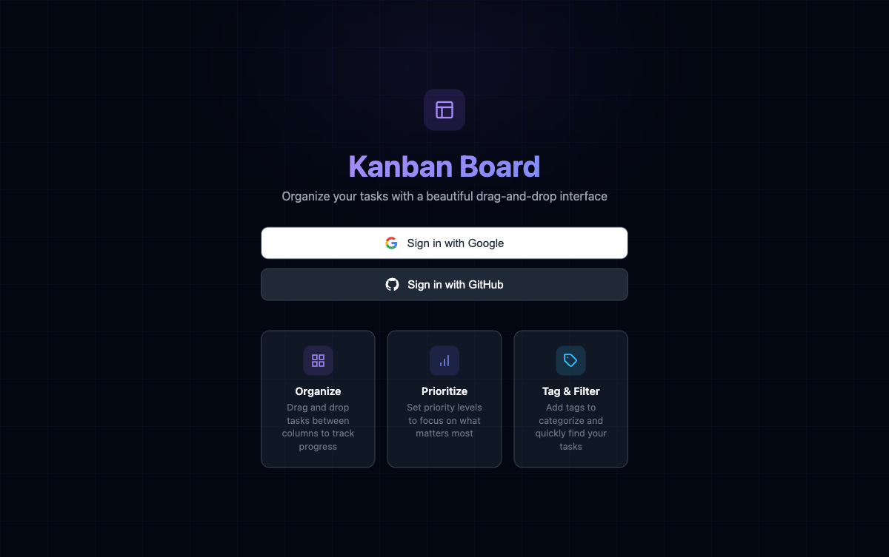

<div align="center">

# Kanban Board

[](https://developer.mozilla.org/en-US/docs/Web/HTML)
[](https://developer.mozilla.org/en-US/docs/Web/CSS)
[](https://developer.mozilla.org/en-US/docs/Web/JavaScript)
[](https://firebase.google.com/)
[](https://alfredang.github.io/kanban/)
[](LICENSE)

**A beautiful drag-and-drop Kanban board with real-time sync, built with vanilla HTML/CSS/JS and Firebase.**

[Live Demo](https://alfredang.github.io/kanban/) · [Report Bug](https://github.com/alfredang/kanban/issues) · [Request Feature](https://github.com/alfredang/kanban/issues)

</div>

## Screenshot



## About

Kanban Board is a lightweight task management app with a sleek dark UI and violet accent theme. It uses Firebase for authentication and real-time data sync — no frameworks, no build step, just pure HTML, CSS, and JavaScript.

### Key Features

| Feature | Description |
|---------|-------------|
| **Drag & Drop** | Move tasks between columns with native HTML5 drag and drop |
| **Three Columns** | To Do, In Progress, and Completed with color-coded headers |
| **Task CRUD** | Create, edit, and delete tasks via a clean modal interface |
| **Priority Levels** | Low (green), Medium (amber), and High (red) badges |
| **Color-coded Tags** | Add comma-separated tags with auto-assigned color badges |
| **OAuth Login** | Sign in with Google or GitHub via Firebase Auth |
| **Real-time Sync** | Tasks sync instantly across devices with Cloud Firestore |
| **Dark Theme** | Modern dark UI with violet accent colors |
| **Responsive** | Works on desktop and mobile screens |

## Tech Stack

| Layer | Technology |
|-------|-----------|
| **Frontend** | HTML5, CSS3, JavaScript (ES6+) |
| **Authentication** | Firebase Auth (Google, GitHub OAuth) |
| **Database** | Cloud Firestore (real-time listeners) |
| **Hosting** | GitHub Pages (GitHub Actions CI/CD) |
| **CLI** | Firebase CLI (rules & index deployment) |

## Architecture

```
┌──────────────────────────────────────────────┐
│                   Browser                    │
│  ┌────────────┐ ┌──────────┐ ┌───────────┐  │
│  │ index.html │ │ style.css│ │  app.js   │  │
│  │  Welcome   │ │  Dark    │ │  Auth     │  │
│  │  Board     │ │  Theme   │ │  CRUD     │  │
│  │  Modal     │ │  Violet  │ │  Drag&Drop│  │
│  └────────────┘ └──────────┘ └─────┬─────┘  │
│                                    │         │
└────────────────────────────────────┼─────────┘
                                     │
                    ┌────────────────┼────────────────┐
                    │          Firebase               │
                    │  ┌─────────────┐ ┌───────────┐  │
                    │  │    Auth     │ │ Firestore  │  │
                    │  │  Google     │ │  tasks     │  │
                    │  │  GitHub     │ │  (per-user)│  │
                    │  └─────────────┘ └───────────┘  │
                    └─────────────────────────────────┘
```

## Project Structure

```
kanban/
├── index.html              # Main HTML — welcome page, board, modal
├── style.css               # Dark theme with violet accents
├── app.js                  # Auth, Firestore CRUD, drag & drop, rendering
├── firebase-config.js      # Firebase project configuration
├── firestore.rules         # Security rules (user-scoped tasks)
├── firestore.indexes.json  # Composite index (userId + position)
├── firebase.json           # Firebase CLI config
├── .firebaserc             # Firebase project alias
├── screenshot.png          # App screenshot
└── .github/
    └── workflows/
        └── deploy.yml      # GitHub Pages deployment via Actions
```

## Getting Started

### Prerequisites

- A [Firebase](https://console.firebase.google.com/) account
- [Firebase CLI](https://firebase.google.com/docs/cli) installed (`npm install -g firebase-tools`)
- [Node.js](https://nodejs.org/) (for local serving)

### Installation

1. **Clone the repo**

   ```bash
   git clone https://github.com/alfredang/kanban.git
   cd kanban
   ```

2. **Set up Firebase**

   - Create a project at [Firebase Console](https://console.firebase.google.com/)
   - Add a **Web App** and copy the config into `firebase-config.js`
   - Enable **Authentication** — Google and/or GitHub sign-in providers
   - Enable **Cloud Firestore** (start in test mode)

3. **Deploy Firestore rules and indexes**

   ```bash
   firebase login
   firebase deploy --only firestore:rules,firestore:indexes
   ```

4. **Run locally**

   ```bash
   npx serve .
   ```

   Open the URL shown in your terminal.

## Deployment

The app auto-deploys to **GitHub Pages** on every push to `main` via GitHub Actions.

To enable GitHub Pages:
1. Go to your repo **Settings** > **Pages**
2. Set Source to **GitHub Actions**
3. Push to `main` — the workflow handles the rest

Live site: [https://alfredang.github.io/kanban/](https://alfredang.github.io/kanban/)

## Security

- Firestore rules scope all tasks to the authenticated user (`userId == auth.uid`)
- Authentication is required for all database operations
- Firebase API keys are safe for client-side use (security is enforced by Firestore rules)

## Contributing

1. Fork the repository
2. Create your feature branch (`git checkout -b feature/amazing-feature`)
3. Commit your changes (`git commit -m 'Add amazing feature'`)
4. Push to the branch (`git push origin feature/amazing-feature`)
5. Open a Pull Request

## Developed By

**Alfred Ang** — [GitHub](https://github.com/alfredang)

## License

Distributed under the MIT License. See `LICENSE` for more information.

---

<div align="center">
If you found this useful, please consider giving it a star!
</div>
